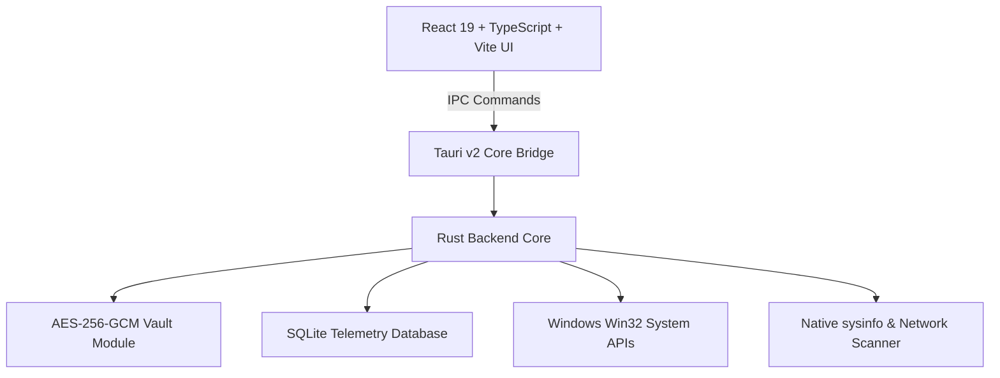

# Orion - System Intelligence & Performance Platform

[](https://github.com/orion-intelligence/orion/actions/workflows/ci.yml)
[](https://tauri.app/)
[](https://react.dev/)
[](https://www.typescriptlang.org/)
[](https://www.rust-lang.org/)
[](LICENSE)

**Orion** is an advanced desktop intelligence and system monitoring platform built using **Tauri v2**, **React 19**, **TypeScript**, and **Rust**. Designed specifically for high-performance laptops and workstations, Orion offers real-time hardware telemetry, encrypted password management, network diagnostics, storage optimization, and AI-assisted system diagnostics.

---

## Key Features

- 🔐 **Bank-Grade Password Vault**: Encrypted credentials using **AES-256-GCM**, **Argon2id** key derivation, and **CSPRNG** password generation stored in protected user AppData (`%APPDATA%\OrionPlatform\`).
- ⚡ **Live Hardware Telemetry**: Low-overhead monitoring of CPU, RAM, battery health, storage envelopes, and process working sets via native Rust `sysinfo` and Windows APIs.
- 🌐 **Network Intelligence**: Integrated port scanner, Wi-Fi auditor, ping latency tester, and Cloudflare WireGuard VPN manager.
- 🧹 **Storage Cleaner**: Deep junk file scanning, cache cleanup, and storage breakdown visualization.
- 🤖 **Local AI Assistant**: Native Ollama local LLM integration with built-in dynamic system diagnostic fallback.
- 🛡️ **Security Diagnostics**: TPM 2.0 status verification, BitLocker status, Windows Defender scan triggering, and authentic SHA-256 / MD5 file hash verification.
- 🧩 **Isolated Error Boundaries**: Component-level crash protection ensuring seamless UI stability.

---

## Tech Stack & Architecture



- **Frontend**: React 19, TypeScript 5.8, Tailwind CSS, Lucide Icons, ECharts
- **Backend Core**: Rust 2021, Tauri v2
- **Storage**: SQLite (`rusqlite`), AES-256-GCM Encrypted JSON
- **Cryptography**: `aes-gcm`, `argon2`, `sha2`, `md5`, `rand` (CSPRNG)

---

## Prerequisites

Before building Orion, ensure you have the following installed:

- **Node.js**: v18.0 or higher (`npm v10+`)
- **Rust Toolchain**: Stable channel (`cargo`, `rustc`)
- **Build Tools**:
  - **Windows**: [Visual Studio C++ Build Tools](https://visualstudio.microsoft.com/visual-cpp-build-tools/) or MSVC workload.

---

## Getting Started

### 1. Clone Repository
```bash
git clone https://github.com/orion-intelligence/orion.git
cd orion
```

### 2. Install Dependencies
```bash
npm install
```

### 3. Run Development Build
```bash
npm run tauri dev
```

### 4. Run Automated Test Suite
```bash
# Frontend Unit Tests (Vitest)
npm run test

# Rust Backend Tests
cargo test --manifest-path src-tauri/Cargo.toml
```

### 5. Production Build
```bash
npm run build
npm run tauri build
```

---

## Security Policy

Security is a core priority for Orion. All cryptographic modules follow OWASP & NIST standards. If you discover a security vulnerability, please refer to our [SECURITY.md](SECURITY.md) guidelines for reporting procedures.

---

## Contributing

We welcome community contributions! Please view [CONTRIBUTING.md](CONTRIBUTING.md) and adhere to our [CODE_OF_CONDUCT.md](CODE_OF_CONDUCT.md).

---

## License

Orion is open-source software licensed under the [MIT License](LICENSE).
